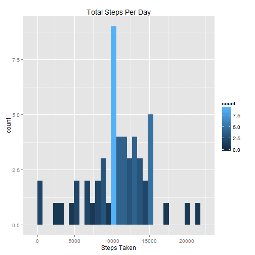
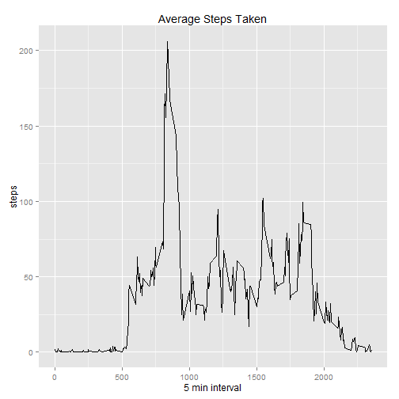
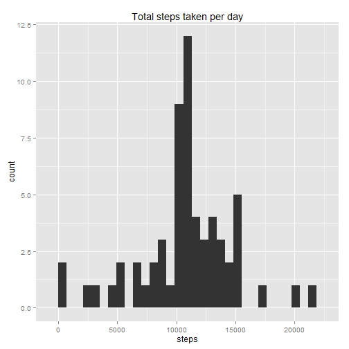
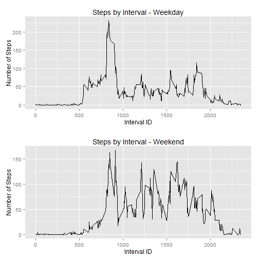

Reproducible Research : Peer Assessment 1
===========================


```r
library(ggplot2)
library(reshape2)
library(dplyr)
library(lubridate)
library(gridExtra)
```
##Loading and preprocessing the data


```r
data <- read.csv("activity.csv")
data$date <- as.Date(data$date)
data <- filter(data, !is.na(steps))
```

##What is mean total number of steps taken per day?

1. Calculate the total number of steps taken per day

```r
Avg <- melt(data, id.vars = "date")
Avg <- dcast(Avg, date ~ variable, fun = sum)
```
2. Make a histogram of the total number of steps taken each day


```r
chart <- ggplot(Avg, aes(x=steps, fill = ..count..)) + ggtitle("Total Steps Per Day") + xlab("Steps Taken" )
chart + geom_histogram()
```

```
## stat_bin: binwidth defaulted to range/30. Use 'binwidth = x' to adjust this.
```

 

3. Calculate and report the mean and median total number of steps taken per day

```r
Mean_step <- mean(Avg$steps)
Median_step <- median(Avg$steps)
```

The median step per day is 1766.18
The mean step per day is 10765

##What is the daily average pattern?

1. Make a time series plot (i.e. type = "l") of the 5-minute interval (x-axis) and the average number of steps taken, averaged across all days (y-axis)

```r
interval <- melt(data, id.vars = "interval")
```

```
## Warning: attributes are not identical across measure variables; they will
## be dropped
```

```r
interval_avg <- dcast(interval, interval ~ variable, fun = mean)
qplot(interval, steps, data = interval_avg, geom = "line", main ="Average Steps Taken", xlab = "5 min interval")
```

 


```r
Max_int <- arrange(interval_avg, desc(steps))
```
2. Which 5-minute interval, on average across all the days in the dataset, contains the maximum number of steps?

The 5 minute interval with the most steps is interval 835

##Inputing missing Values

Ther are a number of days/intervals where there are missing values (coded as NA). The presence of missing days may introduce bias into some calculations or summaries of the data.

1. Calculate and report the total number of missing values in the dataset (i.e. the total number of rows with NAs)

```r
data <- read.csv("activity.csv")
NA_values <- sum(is.na(data))
```
The total number of NA values is 2304

2. Devise a strategy for filling in all of the missing values in the dataset.

3. Create a new dataset that is equal to the original dataset but with the missing data filled in.

```r
data <- mutate(data, steps = ifelse(is.na(steps),interval_avg$steps, steps))
```
4. Make a histogram of the total number of steps taken each day and Calculate and report the mean and median total number of steps taken per day.

```r
Avg <- melt(data, id.vars = "date")
Avg <- dcast(Avg, date ~ variable, fun = sum)
mean_steps2 <- mean(Avg$steps)
median_step2 <- median(Avg$steps)
median_step2 <- round(median_step2, digits = 2)
qplot(steps, data = Avg, geom = "histogram", main = "Total steps taken per day")
```

```
## stat_bin: binwidth defaulted to range/30. Use 'binwidth = x' to adjust this.
```

 

The median steps per day is 10765 . The mean steps per day is 10766.18

Do these values differ from the estimates from the first part of the assignment? No, they do not.

What is the impact of imputing missing data on the estimates of the total daily number of steps?

## Are there differences in activity patterns between weekdays and weekends?
1. Create a new factor variable in the dataset with two levels - "weekday" and "weekend" indicating whether a given date is a weekday or weekend day

```r
data <- mutate(data, DOW = wday(data$date, label = TRUE))
data <- mutate(data, Factor = ifelse(DOW == "Sat" | DOW == "Sun", "Weekend", "Weekday"))
Avg_wk <- select(data, Factor, interval, steps)
Avg_wk_final <- melt(Avg_wk, id.vars = c("Factor", "interval"))
Avg_wk_final <- dcast(Avg_wk_final, Factor + interval ~ variable, fun = mean)
Avg_wk_final$steps <- as.character(Avg_wk_final$steps)
Avg_wk_final$steps <- as.numeric(Avg_wk_final$steps)
```

2.Make a panel plot containing a time series plot (i.e. type = "l") of the 5-minute interval (x-axis) and the average number of steps taken, averaged across all weekday days or weekend days (y-axis).


```r
Weekend <- filter(Avg_wk_final, Factor == "Weekend")
Weekday <- filter(Avg_wk_final, Factor == "Weekday")
plot1 <- qplot(Weekday$interval, Weekday$steps, geom="line", data=Weekday, type="bar", main="Steps by Interval - Weekday", xlab="Interval ID", ylab="Number of Steps")
plot2 <- qplot(interval, steps, geom="line", data=Weekend, type="bar", main="Steps by Interval - Weekend", xlab="Interval ID", ylab="Number of Steps")
grid.arrange(plot1, plot2, nrow=2)
```

 
